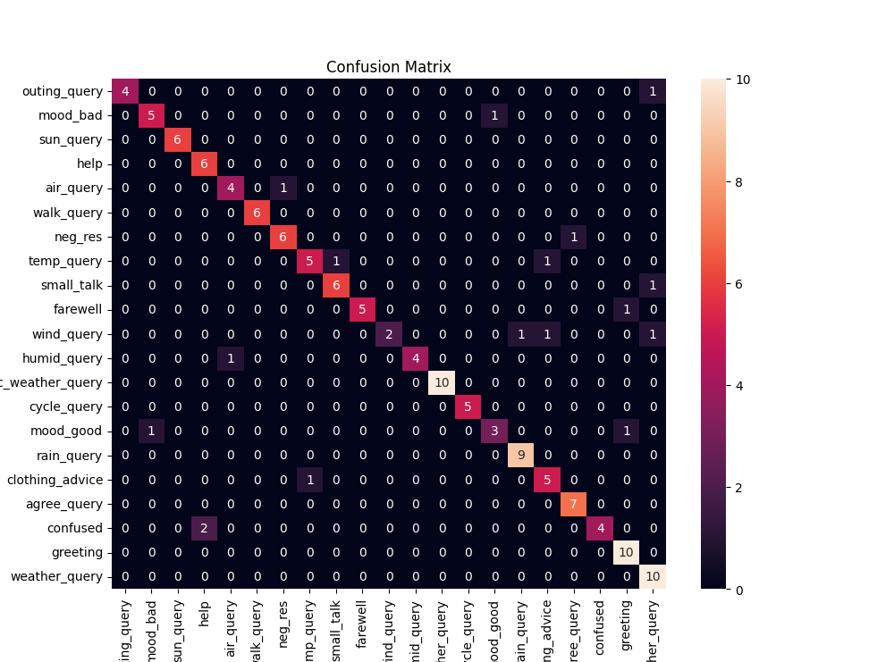
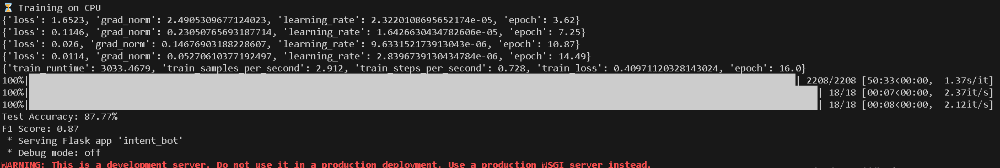

# 🌤️ WeatherChat AI — Custom Intent Classifier for Weather Chatbot

A weather application feature that integrates a custom-built **AI-based intent classifier** to understand user queries — no need for services like Dialogflow or a credit card.

---

## 📌 Project Description

Originally built to enhance a Flutter-based weather app, this project introduces a **lightweight, custom NLP model** trained to classify conversational queries (e.g., "Will it rain today?") into clear weather-related intents.

When services like Dialogflow required credit card access, I decided to build and train my own intent classification model instead — giving full control and zero dependency.

---

## 🚀 Features

- Classifies weather-related queries into intents
- Built using HuggingFace `distilBERT`
- Trained on labeled conversational examples
- Easy deployment: Use locally or via Hugging Face
- Flutter-ready via REST API or direct integration

---

## 🧠 AI Model Details

| Component       | Description                                    |
|----------------|------------------------------------------------|
| Model Base     | `distilbert-base-uncased`                      |
| Frameworks     | 🤗 Transformers, PyTorch, Accelerate           |
| Training Epochs| 16                                              |
| Batch Size     | 16 (GPU) / 4 (CPU)                             |
| Output         | Trained model + tokenizer + label mappings     |

---

## 🗂️ Supported Intents

The classifier is trained to understand the following intent categories:

- `greetings` – e.g., hi, hello
- `small_talk` – how are you?, what's up?
- `farewell` – bye, see ya
- `agree_query` – ok, yes, sure
- `neg_res` – no, not really
- `confused` – what?, huh?
- `help` – how does this work?
- `weather_query` – current weather at given coordinates
- `rain_query` – will it rain today?
- `temp_query` – temperature inquiries
- `humid_query` – humidity-related questions
- `wind_query` – wind-related
- `sun_query` – sunrise/sunset or sunlight
- `air_query` – air quality or pollution
- `location_specific_weather_query` – weather in another location
- `clothing_advice` – what to wear?
- `walk_query`, `cycle_query`, `outing_query` – activity suitability
- `mood_good`, `mood_bad` – user's emotional tone

---

# 🖼️ Model Output Samples

Below are example screenshots/results generated from this AI model's predictions:

### ✅ Intent Classification Example 1  


### ✅ Intent Classification Example 2  


## 🧪 Try the Model on Hugging Face

You can also use this model directly via Hugging Face — no setup needed!

👉 [**Try it on Hugging Face**](Deadlywolf12/Weather_chatbot_Ai_Model)  
(Replace with your actual link)

Use it via `transformers`:


```python
from transformers import AutoTokenizer, AutoModelForSequenceClassification

model_name = "Deadlywolf12/Weather_chatbot_Ai_Model"  # Replace with your actual HF repo name
tokenizer = AutoTokenizer.from_pretrained(model_name)
model = AutoModelForSequenceClassification.from_pretrained(model_name)

def detect_intent(message: str) -> str:
    inputs = tokenizer(message, return_tensors="pt", truncation=True, padding=True)
    with torch.no_grad():
        outputs = model(**inputs)
        logits = outputs.logits
        predicted_class_id = logits.argmax().item()

    labels = model.config.id2label  # e.g., {0: "greetings", 1: "todayWeather", ...}
    return labels[predicted_class_id]
